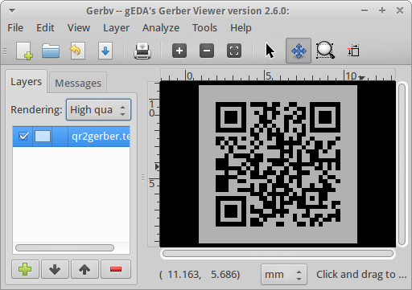
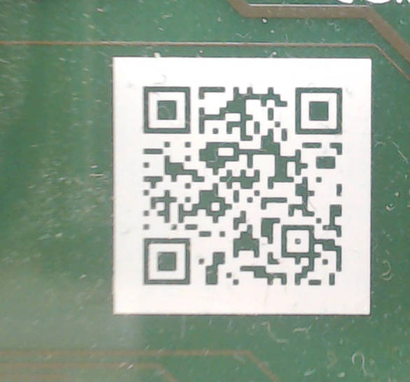
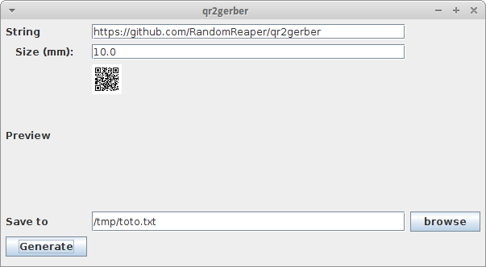

# qr2gerber
## a QR code generator for gerber (PCB) file format.

This small software converts a text string to a QR code and generates the corresponding gerber file for inclusion on a PCB.

## Examples
For generating a QR code containing `https://github.com/RandomReaper/qr2gerber` of size 10.0 mm x 10.0 mm, and saving the result to `/tmp/qr2gerber.test`:
`java -cp qr2gerber-1.0-SNAPSHOT-jar-with-dependencies.jar org.pignat.app.qr2gerber.Cli "https://github.com/RandomReaper/qr2gerber" 10.0 /tmp/qr2gerber.test`

The resulting QR code as seen by [gerbv](http://gerbv.geda-project.org/) (an open source gerber viewer):



Detail of a real board featuring a QR code generated using qr2gerber:


There is also a ugly GUI (org.pignat.app.qr2gerber.App):


## Compiling (command line using maven)
```
git clone https://github.com/RandomReaper/qr2gerber.git
cd qr2gerber/qr2gerber/
mvn package
mvn exec:java -Dexec.args='"https://github.com/RandomReaper/qr2gerber" 10.0 /tmp/qr2gerber.test'
```

## Compiling (eclipse)
* Get eclipse (for java)
* Add the m2e plugin (Maven integration)
* clone this repository.
